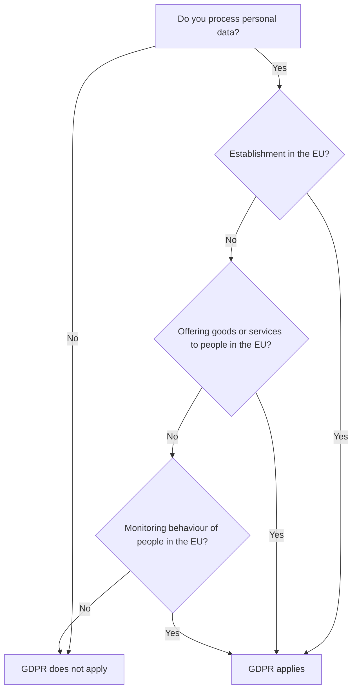

# Module 1: Foundations of the GDPR

<VideoEmbed
  src="https://www.youtube-nocookie.com/embed/PLACEHOLDER_ID_MODULE_01"
  title="Module 1: Foundations of the GDPR"
  timestamp="00:00 to 06:00"
  caption="Watch first. The written notes below go deeper than the video on purpose."
/>

The General Data Protection Regulation (Regulation (EU) 2016/679, usually shortened to "GDPR") is the European Union's single rulebook for how organisations handle personal data. This first module covers three questions: what the law is, who must follow it, and where it stops.

::: info Why this matters
If you ship anything that touches the data of people in the EU, this is the chapter you cannot skip. Modules 2 to 10 all assume you know which articles apply to you.
:::

## A short history

The right to the protection of personal data sits in <ArticleRef href="https://eur-lex.europa.eu/eli/treaty/char_2012/oj" label="Article 8 of the Charter of Fundamental Rights" />. The first attempt at common EU rules came in 1995 with Directive 95/46/EC, but a directive lets each Member State write its own national version. That made compliance noisy for any business operating across borders.

The GDPR replaced the directive in 2016 and became directly applicable in every Member State on 25 May 2018. The same text now binds Berlin, Madrid, Helsinki, and Lisbon. National authorities still enforce it, but the rules are uniform.

::: details Want the official text?
Open the consolidated version on <ArticleRef href="https://eur-lex.europa.eu/eli/reg/2016/679/oj" label="EUR-Lex (Reg. (EU) 2016/679)" />. You can switch between all 24 EU languages from the same page.
:::

## What the GDPR is not

The GDPR is one of several EU privacy rules. Three near-neighbours often get confused with it:

| Rule | Scope | How it relates to GDPR |
|---|---|---|
| ePrivacy Directive (2002/58/EC) | Cookies, electronic marketing, traffic data | Sits on top of the GDPR for electronic communications. Cookies need an ePrivacy consent and a GDPR lawful basis. |
| Law Enforcement Directive (LED, 2016/680) | Police and judicial processing | Covers what the GDPR explicitly excludes in Art. 2(2)(d). |
| Data Act, Data Governance Act, AI Act | Sector-specific or horizontal rules | Sit alongside the GDPR. They do not replace it. |

If you process personal data in a commercial setting, the GDPR is your starting point.

## Who must comply (Article 2 and Article 3)

The GDPR applies on two axes: what the activity is (material scope) and where the actors are (territorial scope).

### Material scope, Article 2

The regulation covers any "processing of personal data wholly or partly by automated means" and any non-automated processing that is part of a "filing system." See <ArticleRef href="https://eur-lex.europa.eu/legal-content/EN/TXT/?uri=CELEX:32016R0679#d1e1796-1-1" label="Article 2 GDPR" />.

What is carved out:

- Activities outside EU law (for example, national security).
- The Common Foreign and Security Policy.
- Activities carried out by a natural person "in the course of a purely personal or household activity," for example your phone's contacts list.
- Police and criminal-justice processing, which is covered by the Law Enforcement Directive.

### Territorial scope, Article 3

This is the part that often surprises non-EU companies. See <ArticleRef href="https://eur-lex.europa.eu/legal-content/EN/TXT/?uri=CELEX:32016R0679#d1e1888-1-1" label="Article 3 GDPR" /> and EDPB Guidelines 3/2018 on Territorial Scope.

The GDPR applies in three situations:

1. **Establishment in the Union (Art. 3(1)).** Your company has a branch, office, or even one employee in the EU and the processing happens "in the context of the activities" of that establishment.
2. **Targeting (Art. 3(2)(a)).** You offer goods or services to people in the Union, paid or free.
3. **Monitoring (Art. 3(2)(b)).** You track the behaviour of people in the Union, for example through analytics, advertising IDs, or location pings.

::: warning A common myth
"We are not based in the EU, so the GDPR does not apply to us."

Wrong. A US SaaS that sells to a Spanish customer, or a Japanese app that uses an EU-targeted analytics SDK, is in scope under Art. 3(2). The EDPB clarified this in Guidelines 3/2018.
:::

## When did it start?

The GDPR was published in the Official Journal on 4 May 2016, entered into force on 24 May 2016, and applied from 25 May 2018 (a 24-month transition window, set in <ArticleRef href="https://eur-lex.europa.eu/legal-content/EN/TXT/?uri=CELEX:32016R0679#d1e6479-1-1" label="Article 99 GDPR" />). No further transitional dates remain.

## Common myths worth unlearning

::: danger Three myths that still cost organisations real money
1. "Only big tech companies need to worry." Fines have been issued against SMEs, schools, sports clubs, even a single sole trader. Size is not a shield.
2. "Anonymised data is in scope." Truly anonymised data is out of scope (Recital 26). Pseudonymised data is still personal data.
3. "Consent is always required." Consent is one of six lawful bases. We cover all six in Module 4. Picking the wrong one is one of the most common compliance errors.
:::

## For builders

::: tip If you write code or run product
Three things to bake in from day one:

- A field-level inventory of personal data your service stores and where it is replicated.
- A configurable retention policy (Module 3 covers storage limitation).
- An export route for a data subject's record (Module 5 covers the right of access and portability).

These three exist regardless of the lawful basis you eventually pick.
:::

## For compliance

::: tip If you sit closer to legal
Use Article 3 as your scoping memo. Document, in one paragraph per business line:

1. Which establishment, if any, the processing belongs to.
2. Whether the line offers goods or services to people in the Union.
3. Whether the line monitors behaviour of people in the Union.

Keep that memo current. It is the cleanest evidence of accountability under Art. 5(2).
:::

## Module 1 takeaways

- The GDPR is one EU law, directly applicable since 25 May 2018, written in 99 Articles and 173 Recitals.
- It covers the processing of personal data, with narrow carve-outs in Art. 2.
- It reaches non-EU organisations through Art. 3(2), if they target EU people or monitor their behaviour.
- It sits next to other rules, especially the ePrivacy Directive for cookies and electronic marketing.
- The Charter of Fundamental Rights provides the underlying right to data protection.

## Quick self-audit

- [ ] We have written down whether each of our products has an "establishment in the Union" (Art. 3(1)).
- [ ] For every product, we have noted whether it targets EU people or monitors their behaviour (Art. 3(2)).
- [ ] We have a one-paragraph memo on which Member State authority would be our lead, if any.
- [ ] We can name at least one piece of personal data we currently process.

## Source anchors

- <ArticleRef href="https://eur-lex.europa.eu/eli/reg/2016/679/oj" label="Regulation (EU) 2016/679, official text" />
- <ArticleRef href="https://eur-lex.europa.eu/legal-content/EN/TXT/?uri=CELEX:32016R0679#d1e1796-1-1" label="Article 2 GDPR (material scope)" />
- <ArticleRef href="https://eur-lex.europa.eu/legal-content/EN/TXT/?uri=CELEX:32016R0679#d1e1888-1-1" label="Article 3 GDPR (territorial scope)" />
- <ArticleRef href="https://eur-lex.europa.eu/legal-content/EN/TXT/?uri=CELEX:32016R0679#d1e6479-1-1" label="Article 99 GDPR (entry into force)" />
- EDPB Guidelines 3/2018 on the territorial scope of the GDPR (Art. 3): see the [EDPB guidelines and recommendations index](https://www.edpb.europa.eu/our-work-tools/general-guidance/guidelines-recommendations-best-practices_en).

::: info Next up
Module 2 unpacks the vocabulary the rest of the regulation uses: personal data, processing, controller, processor, consent, special categories, and more.
:::
