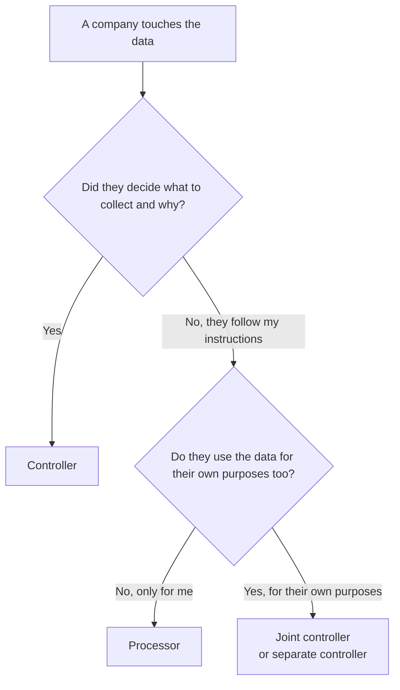

# Module 2: The Key Terms

<VideoEmbed
  src="https://www.youtube-nocookie.com/embed/PLACEHOLDER_ID_MODULE_02"
  title="Module 2: The Key Terms"
  timestamp="06:00 to 12:00"
  caption="Five minutes of vocabulary that saves you ten hours of confusion later."
/>

The GDPR has its own dictionary. Most of it lives in one place: <ArticleRef href="https://eur-lex.europa.eu/legal-content/EN/TXT/?uri=CELEX:32016R0679#d1e2050-1-1" label="Article 4" />. Before the rules make sense, the words have to. This chapter is the short, plain-English version. The full [Glossary](/guide/glossary) has more, but these are the ones you cannot dodge.

::: info Why this chapter exists
Half of all GDPR mistakes come from getting one of these words wrong. "We did not collect personal data, just emails." "We are a processor, not a controller." Both of those sentences are usually wrong, and both lead to bigger problems.
:::

## "Personal data" is broader than you think

Personal data is **any information that points to a living person, directly or indirectly.**

Direct is easy: a name, a face, a phone number.

Indirect is the part that trips people up. An IP address is personal data. A cookie ID is personal data. A customer number on its own is personal data, because you can combine it with your own records to figure out who it is. Even a job title plus a company name can be personal data if it points to one specific person ("the CFO of Acme in Helsinki").

The official wording is in <ArticleRef href="https://eur-lex.europa.eu/legal-content/EN/TXT/?uri=CELEX:32016R0679#d1e2050-1-1" label="Art. 4(1) GDPR" />.

::: tip A simple test
Ask yourself: "Could I, or anyone I share this with, figure out who this person is, using this info plus anything else they might have?" If yes, it is personal data.
:::

### What is **not** personal data

- Info about a company (the company name, the company VAT number, the company address). Companies are not "natural persons."
- Info about a dead person. The GDPR only protects the living. Some EU countries have extra national rules here.
- **Truly** anonymous data, where the link back to a person has been so thoroughly broken that even you cannot put it back together. Most "anonymised" data is actually just pseudonymised (see below) and still counts.

### Special category data, the extra-sensitive kind

Some data needs extra protection. The law calls it "special category" data. <ArticleRef href="https://eur-lex.europa.eu/legal-content/EN/TXT/?uri=CELEX:32016R0679#d1e2294-1-1" label="Art. 9" />

| Special category | Everyday examples |
|---|---|
| Health | Medical history, fitness app readings, sick notes |
| Race or ethnic origin | Diversity surveys, photos in some contexts |
| Religion or belief | Membership of a faith community, dietary preferences in some contexts |
| Sexual life or orientation | Dating app data, HR records |
| Political opinions | Political party membership, advocacy donations |
| Trade union membership | Union dues, organising records |
| Genetic data | DNA samples, ancestry tests |
| Biometric data (when used to identify someone) | Face scans, fingerprints, voice prints |

Handling any of these triggers tougher rules. Module 4 covers what counts as a real reason to keep it.

## "Processing" means anything you do with the data

This one surprises people. "Processing" is not just running data through software. It is anything you do with personal data, from the moment you collect it to the moment you delete it.

> "Processing means any operation or set of operations which is performed on personal data..."
> <ArticleRef href="https://eur-lex.europa.eu/legal-content/EN/TXT/?uri=CELEX:32016R0679#d1e2050-1-1" label="Art. 4(2) GDPR" />

In plain terms, processing covers:

- **Collecting** an email at sign-up.
- **Looking at** a customer file.
- **Copying** a CSV to a new laptop.
- **Sending** a customer list to your email tool.
- **Storing** the contact list in your CRM.
- **Deleting** the same list a year later.

If you do any of these, the GDPR applies. Even keeping a paper folder in a drawer counts, as long as the folder is sorted in a "filing system."

::: warning A common myth
"We only store data, we do not process it."

Storage is processing. So is reading. So is forwarding. The word is the umbrella, not one specific activity.
:::

## Controller vs. processor, the biggest source of confusion

These are the two most important roles in the law, and the difference matters because the obligations are different.

### Controller

The controller is the one who **decides what data to collect and what to do with it.** If you run an online shop, you decided to ask for customer names and addresses. You decided to send them order confirmations. You are the controller. <ArticleRef href="https://eur-lex.europa.eu/legal-content/EN/TXT/?uri=CELEX:32016R0679#d1e2050-1-1" label="Art. 4(7)" />

### Processor

A processor is a **company you hire that handles the data on your behalf and only does what you tell it to.** Your email-sending tool, your cloud host, your payroll provider, your help-desk software. They process the data, but they did not decide what to collect or why. <ArticleRef href="https://eur-lex.europa.eu/legal-content/EN/TXT/?uri=CELEX:32016R0679#d1e2050-1-1" label="Art. 4(8)" />

### A quick test

The EDPB has a thorough breakdown in <a href="https://www.edpb.europa.eu/our-work-tools/our-documents/guidelines/guidelines-072020-concepts-controller-and-processor-gdpr_en" target="_blank" rel="noopener noreferrer">Guidelines 07/2020 on the concepts of controller and processor</a>.

::: tip For builders
The same vendor can play different roles for different features. Your analytics provider might be your processor for app events but a separate controller for the cookies they set in their own marketing pixel. Map it per feature, not per vendor.
:::

### Sub-processors

A sub-processor is a company your processor hires. If you use a help-desk SaaS and the help-desk uses AWS, AWS is your sub-processor. You need to know they exist, and your contract with the help-desk has to keep them on the same rules. Module 6 covers this in detail.

## Consent has a strict meaning

In everyday English, "consent" is loose. In the GDPR, it is precise.

A valid consent has to be:

- **Freely given.** Not buried inside a "you must agree to all this to use our service" clause for stuff that has nothing to do with the service.
- **Specific.** One yes for one purpose. "Consent to everything" does not count.
- **Informed.** The person knows what they are agreeing to.
- **An unambiguous yes.** A pre-ticked box, a "continue" button with no opt-in, or silence does not count.

You also need to be able to **prove** they said yes, and they can change their mind at any time, just as easily as they gave it. <ArticleRef href="https://eur-lex.europa.eu/legal-content/EN/TXT/?uri=CELEX:32016R0679#d1e2050-1-1" label="Art. 4(11)" /> and <ArticleRef href="https://eur-lex.europa.eu/legal-content/EN/TXT/?uri=CELEX:32016R0679#d1e2289-1-1" label="Art. 7" />

The EDPB's <a href="https://www.edpb.europa.eu/our-work-tools/our-documents/guidelines/guidelines-052020-consent-under-regulation-2016679_en" target="_blank" rel="noopener noreferrer">Guidelines 05/2020 on consent</a> are short and worth a read.

::: danger A myth that costs money
"Consent is always required."

Consent is one of six legal reasons to keep data (see [Module 4](/modules/04-lawful-bases)). For a lot of business activities, consent is the wrong choice and another reason fits better.
:::

## A few more words you will keep meeting

### Data subject

The official term for the person whose info you hold. We mostly just say "the person," "your customer," or "your user" on this site. The right side of every page has a [Glossary](/guide/glossary) link if you ever need the formal term.

### Pseudonymisation

You scramble the obvious identifiers (the name, the email) and keep a separate key that can unscramble them. It reduces risk, but the data is still personal data, so the GDPR still applies. <ArticleRef href="https://eur-lex.europa.eu/legal-content/EN/TXT/?uri=CELEX:32016R0679#d1e2050-1-1" label="Art. 4(5)" />

### Anonymisation

You go further: you make it so that nobody, including you, can ever link the data back to a person again. **Truly** anonymised data falls outside the GDPR. Be honest about whether you have actually achieved this. The bar is high.

### Personal data breach

The data gets lost, stolen, leaked, deleted by mistake, or accidentally changed. Confidentiality, integrity, or availability problems all count. Sending an email with a customer list to the wrong person is a personal data breach. So is a ransomware attack. So is a backup tape going missing. <ArticleRef href="https://eur-lex.europa.eu/legal-content/EN/TXT/?uri=CELEX:32016R0679#d1e2050-1-1" label="Art. 4(12)" />

Module 7 covers what to do when one happens.

### Profiling and automated decisions

"Profiling" means using software to evaluate, categorise, or predict things about a person. The targeted ad you saw because your browsing history said you might like camping gear is profiling. The credit score your bank generates is profiling. <ArticleRef href="https://eur-lex.europa.eu/legal-content/EN/TXT/?uri=CELEX:32016R0679#d1e2050-1-1" label="Art. 4(4)" />

A fully automated decision (no human involved) that has a "significant effect" on someone (loan declined, insurance refused, application rejected) has extra rules. Module 5 covers those.

## A worked example

Imagine you run a small online plant shop based in Lisbon. Walk through the terms with a real example:

| Term | In your plant shop |
|---|---|
| Personal data | Names, shipping addresses, order history, email addresses, IP addresses captured by your website. |
| Special category data | Probably none, unless your "tell us your gardening goals" form catches health info ("I'm in a wheelchair so please avoid heavy pots"). |
| Processing | Collecting the email at checkout, storing the order, sending the confirmation, looking at last quarter's sales report. |
| Controller | You. You decided to collect names, decided to email confirmations, decided to keep order history. |
| Processor | Your Shopify, your email tool (Klaviyo, Mailchimp), your accountant's bookkeeping software. |
| Sub-processor | The cloud host Shopify uses behind the scenes. The vendor your email tool uses to send the actual emails. |
| Consent | The yes-tick for marketing emails. Not for the order confirmation (that has a different reason: the contract). |
| Personal data breach | If you mistakenly download the customer list and email it to your supplier. Yes, even that. |

## Module 2 takeaways

- "Personal data" is anything that points to a living person, directly or with a bit of detective work.
- "Processing" is anything you do with that data, from collecting to deleting.
- The **controller** decides what to collect and why. The **processor** only does what the controller tells it to.
- Consent has a strict meaning: freely given, specific, informed, an unambiguous yes, with proof and a way to withdraw.
- Special category data (health, race, religion, biometrics, etc.) has tougher rules.
- A personal data breach is more than a hack. A misdirected email counts.

## Quick self-audit

- [ ] We can list the kinds of personal data we collect (names, emails, IPs, payment info, etc.).
- [ ] We know whether we collect any special category data.
- [ ] We can name our role for each system (controller, joint controller, or processor).
- [ ] We have a list of every processor we use and what they do for us.
- [ ] If we rely on consent for anything, we can show how it was collected.

## Source anchors

- <ArticleRef href="https://eur-lex.europa.eu/legal-content/EN/TXT/?uri=CELEX:32016R0679#d1e2050-1-1" label="Article 4 GDPR (definitions)" />
- <ArticleRef href="https://eur-lex.europa.eu/legal-content/EN/TXT/?uri=CELEX:32016R0679#d1e2289-1-1" label="Article 7 GDPR (conditions for consent)" />
- <ArticleRef href="https://eur-lex.europa.eu/legal-content/EN/TXT/?uri=CELEX:32016R0679#d1e2294-1-1" label="Article 9 GDPR (special categories)" />
- EDPB <a href="https://www.edpb.europa.eu/our-work-tools/our-documents/guidelines/guidelines-052020-consent-under-regulation-2016679_en" target="_blank" rel="noopener noreferrer">Guidelines 05/2020 on consent</a>
- EDPB <a href="https://www.edpb.europa.eu/our-work-tools/our-documents/guidelines/guidelines-072020-concepts-controller-and-processor-gdpr_en" target="_blank" rel="noopener noreferrer">Guidelines 07/2020 on controller and processor</a>

::: info Next up
Module 3 explains the seven principles every other rule comes back to. They are the rules of thumb you can carry in your head.
:::

<CtaBlock />
