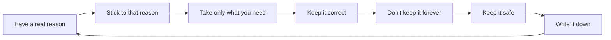

# Module 3: The Seven Core Principles

<VideoEmbed
  src="https://www.youtube-nocookie.com/embed/PLACEHOLDER_ID_MODULE_03"
  title="Module 3: The Seven Core Principles"
  timestamp="12:00 to 18:00"
  caption="Six minutes that explain what the rest of the law is really asking you to do."
/>

If the GDPR were a one-pager, this is the page. Almost every other rule, every fine, every guideline traces back to seven simple ideas. Get these in your bones and the rest starts to feel less like law and more like common sense.

They all live in <ArticleRef href="https://eur-lex.europa.eu/legal-content/EN/TXT/?uri=CELEX:32016R0679#d1e2158-1-1" label="Article 5 GDPR" />. Six of them describe how to handle the data. The seventh, accountability, is the one that bites if you cannot show the other six in action.

::: info A useful shortcut
Whenever you are unsure if something you are doing is okay, walk it through the seven principles in your head. If it fails any of them, the answer is no, or at least not without changes.
:::

## 1. Have a real reason. Be fair. Be honest.

Officially: **lawfulness, fairness and transparency.** <ArticleRef href="https://eur-lex.europa.eu/legal-content/EN/TXT/?uri=CELEX:32016R0679#d1e2158-1-1" label="Art. 5(1)(a)" />

In plain words:

- **Lawful** means you have one of six allowed reasons to keep this info. Module 4 walks through all six.
- **Fair** means you treat the person reasonably. No tricks. No buried clauses. No "we said it in microscopic text on page 23 of the terms."
- **Transparent** means you actually tell people what you are doing. A privacy notice in plain language. Honest cookie banners. No nasty surprises later.

### A quick sanity check

> If somebody asked your customer, "Did you know the company collects X about you and uses it for Y?", would they say "yes, that was clear"?

If the honest answer is "probably not," you are failing this principle.

::: warning Dark patterns are a fairness fail
Pre-ticked boxes. "Reject all cookies" buried three clicks deep. Buttons coloured to nudge yes. These all break the fairness leg of this principle, and regulators have been increasingly direct about it.
:::

## 2. Stick to the reason you gave

Officially: **purpose limitation.** <ArticleRef href="https://eur-lex.europa.eu/legal-content/EN/TXT/?uri=CELEX:32016R0679#d1e2158-1-1" label="Art. 5(1)(b)" />

When you collect info, you should already know why. And you can only use it for that reason. If you later want to use it for something different, you need to think again about whether that is still okay.

A worked example:

| Original reason you collected the email | Allowed reuse? | Why |
|---|---|---|
| To send the order confirmation | Sending a follow-up about that same order | Yes, same purpose |
| To send the order confirmation | Adding them to your marketing newsletter | No, that is a new purpose, you need consent or a different reason |
| To set up a user account | Showing them their order history | Yes, plausibly part of the same purpose |
| To set up a user account | Selling the email to an advertising partner | No, different purpose, not compatible |

The test is whether the new purpose is "compatible" with the old one. If it would surprise the customer, it usually is not compatible.

## 3. Take only what you need

Officially: **data minimisation.** <ArticleRef href="https://eur-lex.europa.eu/legal-content/EN/TXT/?uri=CELEX:32016R0679#d1e2158-1-1" label="Art. 5(1)(c)" />

The fewest fields, the fewest records, the shortest list that gets the job done. The instinct to "collect everything, we might need it later" is exactly what this principle is meant to kill.

A few common over-collection mistakes:

- A sign-up form asks for date of birth when the service does not actually care about age.
- A support ticket form asks for the customer's full home address when it is only an app login issue.
- A demo request form asks for phone number when nobody on your team ever calls leads.

Every extra field is a future risk. Less data is less to lose, less to leak, less to argue about.

::: tip For builders
Audit your forms once a quarter. For each field, ask: "What would break if we removed this?" If the answer is "nothing immediate," remove it.
:::

## 4. Keep it correct

Officially: **accuracy.** <ArticleRef href="https://eur-lex.europa.eu/legal-content/EN/TXT/?uri=CELEX:32016R0679#d1e2158-1-1" label="Art. 5(1)(d)" />

If the info you hold is wrong, you have to fix it or delete it. Two things follow:

- People have the right to ask you to correct things about them (see [Module 5](/modules/05-data-subject-rights), the right to rectification).
- You should have an easy way to spot and fix bad data, even when nobody complains. A typo'd email that bounces every month is technically an accuracy problem.

You do not have to be perfect. The law says "reasonable steps." But "we never check" is not reasonable.

## 5. Don't keep it forever

Officially: **storage limitation.** <ArticleRef href="https://eur-lex.europa.eu/legal-content/EN/TXT/?uri=CELEX:32016R0679#d1e2158-1-1" label="Art. 5(1)(e)" />

Set a retention period. Then actually delete (or properly anonymise) when it expires.

Rough rules of thumb that hold up in most cases:

| Kind of data | Often-reasonable retention |
|---|---|
| Customer order records (for tax and accounting) | 6 to 10 years, depends on your country |
| Marketing list of people who opted in | Until they opt out, plus reasonable cleanup if inactive |
| Job applicants you did not hire | 6 to 12 months |
| Website analytics events | 14 to 26 months is a common ceiling |
| Support tickets after resolution | 2 to 3 years is typical |

Write down what you keep, for how long, and why. That document is one of the most useful privacy artefacts you will ever produce.

::: danger A common, expensive mistake
"We will just keep everything forever, just in case."

That fails this principle. Worse, when the leak eventually happens, you will have a much bigger pile of data to disclose and pay fines on.
:::

## 6. Keep it safe

Officially: **integrity and confidentiality**, sometimes called the **security** principle. <ArticleRef href="https://eur-lex.europa.eu/legal-content/EN/TXT/?uri=CELEX:32016R0679#d1e2158-1-1" label="Art. 5(1)(f)" />

Protect the data with measures that fit the risk. The law calls these "technical and organisational measures." Module 7 covers the detail. The short version for now:

- Encrypt laptops and phones.
- Use strong passwords and two-factor authentication, especially for admin accounts.
- Use HTTPS everywhere.
- Limit who can see what. Not everyone on the team needs the full customer list.
- Have a basic backup. Test it occasionally.
- Have a one-page plan for what to do if it goes wrong.

Bigger company, bigger risk, more measures. A one-person freelancer can manage this with a password manager and full-disk encryption. A 500-person fintech cannot.

## 7. Write it down. Prove it.

Officially: **accountability.** <ArticleRef href="https://eur-lex.europa.eu/legal-content/EN/TXT/?uri=CELEX:32016R0679#d1e2158-1-1" label="Art. 5(2)" />

This is the principle that turns the other six from "nice ideas" into "the regulator will ask you to prove it." Accountability says: you are responsible, and you have to be able to show how you are doing it.

In practice that means a few short documents:

- A list of the personal data you hold and the reason for each batch.
- A list of every tool / vendor that touches the data.
- Your privacy notice.
- A simple breach response plan.
- Records of any consents you collect.
- Notes from any "should we really do this?" reviews you ran before launching something new.

None of these need to be long. A two-page Notion doc per item is often enough for a small team.

::: tip For compliance
If you only do one thing this month, write down the reason you keep each batch of personal data. That single document satisfies most of accountability and most of purpose limitation in one go.
:::

## How they fit together

Think of them as a chain:

Accountability (the last box) loops back around because writing it down is what lets you re-check the others over time.

## A worked example, end to end

Imagine you launch a new feature: customers can save a wishlist on your store. Walk it through:

| Principle | Quick check |
|---|---|
| Lawful, fair, transparent | We tell customers the wishlist is saved to their account. The privacy notice mentions it. We picked "performance of a contract" as the legal reason (they signed up to use this feature). |
| Purpose limitation | We use the wishlist only to show it to the customer. We do not also blast them with marketing about items they wishlisted, unless they separately opted in. |
| Data minimisation | We save product IDs and a timestamp. We do not save who looked at the wishlist for how long. |
| Accuracy | If they remove an item, it removes. If they delete their account, the wishlist goes too. |
| Storage limitation | Inactive accounts get the wishlist purged after 24 months along with the account. |
| Security | The wishlist sits in our normal customer database, encrypted at rest, behind login. |
| Accountability | The whole thing is one paragraph in our internal data inventory document. |

Seven boxes ticked. Ship it.

## Module 3 takeaways

- Article 5 has seven principles. Six describe how to handle the data. The seventh, accountability, says: prove it.
- Have a real reason. Stick to it. Take less. Keep it correct. Do not hoard. Keep it safe. Write it down.
- The principles are not separate from the other rules. They are the rules. Every other article is a more detailed version of one of these seven.
- Regulators reach for Article 5 when they want to cover a lot of ground in one finding.

## Quick self-audit

- [ ] We can name a real reason for every batch of personal data we hold.
- [ ] We do not reuse data for purposes the person would not expect.
- [ ] Our forms only ask for fields we actually use.
- [ ] We have a way to correct or delete wrong data.
- [ ] We have written down how long we keep each kind of data.
- [ ] Our basic security covers laptops, accounts, and backups.
- [ ] We have a short written document that summarises all of the above.

## Source anchors

- <ArticleRef href="https://eur-lex.europa.eu/legal-content/EN/TXT/?uri=CELEX:32016R0679#d1e2158-1-1" label="Article 5 GDPR (principles)" />
- <ArticleRef href="https://eur-lex.europa.eu/legal-content/EN/TXT/?uri=CELEX:32016R0679#d1e2178-1-1" label="Article 6 GDPR (lawfulness)" />, referenced from principle 1, covered in detail in Module 4.
- EDPB <a href="https://www.edpb.europa.eu/our-work-tools/our-documents/guidelines/guidelines-42019-article-25-data-protection-design-and_en" target="_blank" rel="noopener noreferrer">Guidelines 4/2019 on Article 25</a>, which expands minimisation and purpose limitation into product-design language.

::: info Next up
Module 4 unpacks the six "real reasons in law" you can use to keep personal data. Consent is just one of them, and often the wrong one.
:::

<CtaBlock />
