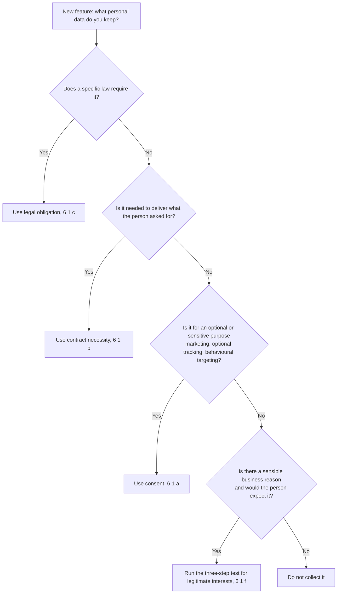

# Module 4: Real Reasons to Keep Data

<VideoEmbed
  src="https://www.youtube-nocookie.com/embed/PLACEHOLDER_ID_MODULE_04"
  title="Module 4: Real Reasons to Keep Data"
  timestamp="18:00 to 24:00"
  caption="The six allowed reasons. How to pick one. Why consent is usually the wrong default."
/>

Every batch of personal data you keep needs **one** reason in the law that lets you keep it. The law calls it a "lawful basis" and lists six of them in <ArticleRef href="https://eur-lex.europa.eu/legal-content/EN/TXT/?uri=CELEX:32016R0679#d1e2178-1-1" label="Article 6(1) GDPR" />. Pick the right one and most of your other obligations fall into place. Pick the wrong one and you can end up redoing privacy notices, consent flows, and customer emails from scratch.

This chapter walks through all six, with worked examples from four small businesses that come back across the rest of the site:

- **Florinha**, a small online plant shop based in Lisbon (e-commerce, B2C).
- **Quadrant**, a 12-person B2B SaaS in Berlin (mid-stage startup).
- **Aoife**, a freelance UX consultant in Dublin (sole trader).
- **Skyloop**, a 60-person mobile-app studio in Helsinki (consumer app).

::: info One thing before we start
Pick exactly one reason per activity, write it down, and stick to it. Mixing two reasons "just to be safe" is one of the most expensive mistakes regulators see. We come back to that in the pitfalls section at the end.
:::

## The six reasons at a glance

| # | Reason (formal name) | In one line | Best for |
|---|---|---|---|
| (a) | Consent | The person clearly said yes | Marketing, optional tracking, sensitive uses |
| (b) | Contract necessity | You need the data to deliver what they paid for | Order processing, account creation, paid services |
| (c) | Legal obligation | A law tells you to keep this | Tax records, employment law, AML checks |
| (d) | Vital interests | Someone's life is in danger | Hospitals, emergencies. Very rarely the right pick in business. |
| (e) | Public interest | A public body needs to do this | Government, public health, public-sector tasks |
| (f) | Legitimate interests | You have a sensible reason and the person would expect it | Fraud prevention, network security, basic analytics |

Now in detail.

## (a) Consent

The person clearly says yes. They could just as easily say no. They can change their mind any time. <ArticleRef href="https://eur-lex.europa.eu/legal-content/EN/TXT/?uri=CELEX:32016R0679#d1e2178-1-1" label="Art. 6(1)(a)" /> and <ArticleRef href="https://eur-lex.europa.eu/legal-content/EN/TXT/?uri=CELEX:32016R0679#d1e2289-1-1" label="Art. 7" />

Consent is what most people imagine when they hear "GDPR." It is also the reason that gets misused most often, because companies reach for it when one of the other five reasons fits better.

For consent to count, all of these have to be true:

- The person actively did something to say yes (ticked a box, clicked a button). A pre-ticked box does not count. Silence does not count.
- They knew what they were saying yes to. A single sentence in plain language above the button.
- They could refuse without losing access to the service for things unrelated to that consent.
- You can show, after the fact, exactly when and how they said yes.
- They can take it back as easily as they gave it.

The EDPB's <a href="https://www.edpb.europa.eu/our-work-tools/our-documents/guidelines/guidelines-052020-consent-under-regulation-2016679_en" target="_blank" rel="noopener noreferrer">Guidelines 05/2020 on consent</a> are short and worth a read.

### Worked example: Quadrant's marketing newsletter

Quadrant, the Berlin SaaS, runs a weekly product newsletter. Some readers are existing customers, some are sign-ups from a "subscribe" form on the website.

For people who clicked the "subscribe" button on the website:
- **Reason**: consent.
- **Proof Quadrant keeps**: the form submission timestamp, the IP address, the wording shown on the form at the time.
- **Withdrawal**: an "unsubscribe" link in the footer of every email that works in one click. No "are you sure?" page.
- **What Quadrant cannot do**: silently move newsletter subscribers into a "trial users" segment for a different mailing list. That would be a new purpose, needing a new consent.

::: warning Consent is not a workaround for bad design
A "click here to accept all cookies and continue, or close the tab" banner does not produce valid consent. The person had no real choice. CNIL has issued multi-million-euro fines on exactly this pattern (Google, 2021; Microsoft, 2022).
:::

## (b) Contract necessity

You need the data to deliver what the person actually asked for, or to set up a contract they want to enter into. <ArticleRef href="https://eur-lex.europa.eu/legal-content/EN/TXT/?uri=CELEX:32016R0679#d1e2178-1-1" label="Art. 6(1)(b)" />

"Necessary" is the keyword. Not "useful." Not "we would like to have it." If the contract literally cannot be performed without it, this basis fits. The EDPB's <a href="https://www.edpb.europa.eu/our-work-tools/our-documents/guidelines/guidelines-22019-processing-personal-data-under-article-61b_en" target="_blank" rel="noopener noreferrer">Guidelines 2/2019 on Art. 6(1)(b)</a> draw the line carefully: "necessary for personalisation" or "necessary for advertising" usually does not pass the test.

### Worked example: Florinha's order processing

Florinha takes online orders for plants and delivers them across Portugal.

To deliver a single order, Florinha must:

- Capture the customer's name (the courier needs it).
- Capture the shipping address (also the courier).
- Capture the email (to send the order confirmation and a "your plant is on its way" link).
- Capture payment details (handled by Stripe, but Florinha holds the order total and last-four-digits for refunds).
- Keep the order history while the warranty period runs (90 days).

All of that is plainly necessary to fulfil the order. The lawful basis for each is **contract necessity**.

What does **not** fit under contract necessity:

- Florinha's marketing newsletter (separate sign-up, separate consent).
- Behavioural targeting for ads on Facebook (consent, or a careful legitimate-interests argument the EDPB is sceptical about).
- Capturing date of birth at checkout. Florinha does not need it to deliver plants. So either drop the field or rely on a different basis if there is one.

::: tip Quick test
Imagine you removed the data field. Would the order literally fail to complete? If yes, contract necessity fits. If "we could still deliver, just less smoothly", look at legitimate interests or consent instead.
:::

## (c) Legal obligation

A specific EU or national law forces you to keep this data. <ArticleRef href="https://eur-lex.europa.eu/legal-content/EN/TXT/?uri=CELEX:32016R0679#d1e2178-1-1" label="Art. 6(1)(c)" />

This one is narrow but rock-solid when it applies. The law has to be a real, identifiable rule, not just "we feel we have to."

### Worked example: Florinha's tax records

The Portuguese tax authority (Autoridade Tributária e Aduaneira) requires Florinha to keep invoice records for 10 years. That means name, billing address, VAT number where relevant, and the line items, even after the customer is long gone.

- **Reason**: legal obligation (the Portuguese tax code).
- **Retention**: 10 years from the invoice date.
- **What Florinha can do during those 10 years**: use the data **only** for tax purposes. Not for marketing. Not for analytics. Once 10 years pass, the obligation expires and the invoices must be deleted or properly archived.

Other common everyday examples:

- Keeping payroll records for the number of years your national employment law sets.
- Anti-money-laundering checks for finance and crypto firms (typically 5 years after the relationship ends).
- The right-to-work check copies an employer must keep under immigration law.

## (d) Vital interests

Someone's life is in immediate danger. <ArticleRef href="https://eur-lex.europa.eu/legal-content/EN/TXT/?uri=CELEX:32016R0679#d1e2178-1-1" label="Art. 6(1)(d)" />

A paramedic looking at an unconscious patient's medical bracelet. A hospital admitting someone in cardiac arrest. A search-and-rescue team checking the registry of hikers on a trail.

In day-to-day business this is almost never the right pick. If you find yourself reaching for it, double-check whether one of the other five fits better.

## (e) Public interest or official authority

You are carrying out a task that is in the public interest, or you have official authority to do it. <ArticleRef href="https://eur-lex.europa.eu/legal-content/EN/TXT/?uri=CELEX:32016R0679#d1e2178-1-1" label="Art. 6(1)(e)" />

Public bodies use this constantly (tax authorities, public hospitals, statistics offices). Private businesses rarely have it, unless a specific law gives them a public-interest task to perform on behalf of the state.

## (f) Legitimate interests

You have a sensible business reason, the person would reasonably expect it, and it does not steamroll their rights. <ArticleRef href="https://eur-lex.europa.eu/legal-content/EN/TXT/?uri=CELEX:32016R0679#d1e2178-1-1" label="Art. 6(1)(f)" />

This is the most flexible basis, and also the one that gets misused the most. The EDPB's <a href="https://www.edpb.europa.eu/our-work-tools/our-documents/guidelines/guidelines-12024-processing-personal-data-based-article-61f_en" target="_blank" rel="noopener noreferrer">Guidelines 1/2024 on legitimate interests</a> set out a three-step test you have to run, and **document**, before using it.

### The three-step test

1. **Purpose test.** Is there a real, lawful interest? Be specific. "Marketing" is too vague. "Sending follow-up emails to customers who left items in their cart" is specific enough.
2. **Necessity test.** Is the processing actually needed to achieve the interest? Could you get the same result with less data, or a different method?
3. **Balancing test.** Do the rights and reasonable expectations of the person outweigh your interest? Vulnerable people (children, employees, patients) tilt the balance against you. Surprise tilts it against you. "Everyone in this industry does this" tilts it slightly in your favour.

If the three boxes are all yes, legitimate interests fits. Write down the answers. That document is your "legitimate interests assessment" (LIA).

### Worked example: Skyloop's fraud-prevention logs

Skyloop runs a mobile shopping app in Helsinki. To catch payment fraud, the app records every login attempt, every device fingerprint, and every transaction's IP address. Logs are kept for 18 months.

Running the three-step test:

| Step | Skyloop's answer |
|---|---|
| Purpose | Catch and block payment fraud before customers and the company lose money. Recital 47 expressly names fraud prevention as a legitimate interest. |
| Necessity | Yes. Fraud detection models need a 12 to 18 month history of normal behaviour to flag the abnormal. Shorter retention has been tried internally and produces worse precision. |
| Balancing | Users would reasonably expect a fintech-flavoured app to do this. The data is restricted to the fraud-engineering team. Customers can ask to see what is held on them. The interest of the customer base (less fraud) and the company (less loss) outweighs the discomfort of an internal log. |

So Skyloop uses **legitimate interests** for the fraud logs and writes a one-page LIA. The privacy notice mentions the logs in plain language so there is no surprise.

::: warning Two places legitimate interests does not fit
- **Surprise marketing.** Cold-emailing prospects who never signed up usually fails the balancing test, especially under the ePrivacy Directive.
- **Sensitive use cases.** If special-category data (health, race, religion, biometrics) is involved, you cannot use legitimate interests at all. Article 9 takes over (see below).
:::

## Picking the right one

When you sit down with a new feature or a new dataset, walk through this:

If you find yourself at the bottom right, do not collect the data. That answer is allowed. In fact it is often the best one.

## Special-category data: extra rules apply

Health, race or ethnic origin, religion or belief, political opinions, sexual orientation, trade union membership, genetic data, biometric data (when used to identify someone). <ArticleRef href="https://eur-lex.europa.eu/legal-content/EN/TXT/?uri=CELEX:32016R0679#d1e2294-1-1" label="Art. 9" />

Article 9 starts with a blanket ban: do not process this kind of data. Then it lists 10 narrow exceptions. The most common in business are:

- The person gave **explicit consent** (a step stricter than ordinary consent).
- The processing is needed for employment, social security, or social protection.
- The processing is needed to establish, exercise, or defend a legal claim.

You always need both an Article 6 basis **and** an Article 9 exception when special-category data is involved.

### Worked example: Florinha's accessibility form

Florinha lets customers add a note at checkout: "I use a wheelchair, please pick light pots." That is health data, and so it is special category.

Florinha's setup:

- **Article 6 basis**: contract necessity (the customer asked for it to be considered in the order).
- **Article 9 exception**: explicit consent. The form has a single, clear checkbox: "I am happy for Florinha to use this note to choose suitable products. I can withdraw at any time."
- **Storage**: the note is attached to that order only, deleted along with the order after the warranty window.
- **Access**: only the pick-and-pack team can see it.

## Children's consent

If you offer "information society services" (an app or website) directly to children, consent has to come from a person with parental responsibility for any child below a certain age. <ArticleRef href="https://eur-lex.europa.eu/legal-content/EN/TXT/?uri=CELEX:32016R0679#d1e2289-1-1" label="Art. 8" />

The age is **16** by default, but each EU country can lower it to as little as **13**. A few common examples:

| Country | Age threshold |
|---|---|
| Belgium, Denmark, Estonia, Finland, Latvia, Malta, Portugal, Spain, Sweden, UK | 13 |
| Bulgaria, Cyprus, Lithuania, Luxembourg, Romania | 14 |
| Austria, Czech Republic, Greece, Italy, Slovenia | 15 |
| France, Germany, Hungary, Ireland, Netherlands, Poland, Slovakia | 16 |

If your audience can include children, you need a way to either age-gate, or get parental consent, or design the product so it does not rely on consent at all.

## Common pitfalls

::: danger Four mistakes that show up in roughly half of all enforcement decisions
1. **Defaulting to consent for everything.** Consent is one of six. For most order processing, account creation, fraud detection, and legal records, a different basis fits better and produces a more stable setup.
2. **Mixing two bases for the same activity.** "We rely on consent **and** legitimate interests" tells the regulator you did not pick. Pick one. Document why. Stick to it.
3. **"Consent or pay" walls.** Forcing the user to either say yes to tracking or buy a paid plan, with no third option, has been challenged repeatedly. The EDPB's 2024 opinion on the model is strict, and large platforms have already been hit (see Meta, 2024).
4. **Skipping the legitimate-interests assessment.** If you say "we use legitimate interests" but cannot produce a one-page LIA, the regulator will treat that as if you had no basis at all. Write it down before you need it.
:::

## Module 4 takeaways

- Article 6(1) lists six lawful bases. Pick exactly one per processing activity.
- Consent is one of six, often not the best fit. Contract necessity and legitimate interests cover more of an average business than consent does.
- Legal obligation is narrow but ironclad when a specific law applies.
- Legitimate interests is flexible but requires a written three-step test.
- Special-category data needs both an Article 6 basis and an Article 9 exception.
- Children's consent has different age thresholds by country (13 to 16).

## Quick self-audit

- [ ] For every batch of personal data we hold, we have written down which of the six bases we rely on.
- [ ] For everything we rely on consent for, we can produce timestamped proof of the yes.
- [ ] Our consent flows have no pre-ticked boxes and no dark patterns.
- [ ] For everything we rely on legitimate interests for, we have a one-page LIA on file.
- [ ] We do not collect special-category data without an Article 9 exception we can name.
- [ ] If our product can be used by children, we know the age threshold in our main markets and how we handle it.
- [ ] We do not mix two bases for the same activity.
- [ ] Our privacy notice tells users, in plain language, which basis we rely on for what.

## Source anchors

- <ArticleRef href="https://eur-lex.europa.eu/legal-content/EN/TXT/?uri=CELEX:32016R0679#d1e2178-1-1" label="Article 6 GDPR (lawfulness of processing)" />
- <ArticleRef href="https://eur-lex.europa.eu/legal-content/EN/TXT/?uri=CELEX:32016R0679#d1e2289-1-1" label="Article 7 GDPR (conditions for consent)" />
- <ArticleRef href="https://eur-lex.europa.eu/legal-content/EN/TXT/?uri=CELEX:32016R0679#d1e2289-1-1" label="Article 8 GDPR (children's consent)" />
- <ArticleRef href="https://eur-lex.europa.eu/legal-content/EN/TXT/?uri=CELEX:32016R0679#d1e2294-1-1" label="Article 9 GDPR (special categories)" />
- EDPB <a href="https://www.edpb.europa.eu/our-work-tools/our-documents/guidelines/guidelines-052020-consent-under-regulation-2016679_en" target="_blank" rel="noopener noreferrer">Guidelines 05/2020 on consent</a>
- EDPB <a href="https://www.edpb.europa.eu/our-work-tools/our-documents/guidelines/guidelines-22019-processing-personal-data-under-article-61b_en" target="_blank" rel="noopener noreferrer">Guidelines 2/2019 on Art. 6(1)(b)</a>
- EDPB <a href="https://www.edpb.europa.eu/our-work-tools/our-documents/guidelines/guidelines-12024-processing-personal-data-based-article-61f_en" target="_blank" rel="noopener noreferrer">Guidelines 1/2024 on legitimate interests</a>
- CNIL deliberation against Google, December 2021 (cookie banner). See <a href="https://www.cnil.fr/en/cookies-google-fined-150-million-euros" target="_blank" rel="noopener noreferrer">CNIL summary, EUR 150 million fine</a>.

::: info Next up
Module 5 covers the eight rights every customer or user has, from "what data do you hold on me?" through to "delete it all." The right of access (Article 15) is the one you will get asked for most often, and we walk through how to handle it without panic.
:::

<CtaBlock />
