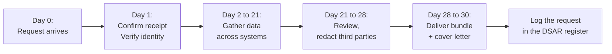

# Module 5: What People Can Ask You

<VideoEmbed
  src="https://www.youtube-nocookie.com/embed/PLACEHOLDER_ID_MODULE_05"
  title="Module 5: What People Can Ask You"
  timestamp="24:00 to 32:00"
  caption="Eight rights, one calendar month, free of charge. The shape of every request you will get."
/>

Every person whose data you hold has a set of rights they can use, and you have to be ready to answer them. Most of the rights live in Chapter III of the GDPR, <ArticleRef href="https://eur-lex.europa.eu/legal-content/EN/TXT/?uri=CELEX:32016R0679#d1e2606-1-1" label="Articles 12 to 22" />. This chapter walks through each one in plain English, using the same four personas we met in Module 4:

- **Florinha**, the online plant shop in Lisbon.
- **Quadrant**, the B2B SaaS in Berlin.
- **Aoife**, the freelance UX consultant in Dublin.
- **Skyloop**, the mobile-app studio in Helsinki.

::: info Three rules that apply to all of them
1. **One calendar month** to respond, counted from the day the request reached you. You can extend by two more months for genuinely complex requests, but you must tell the person within the first month.
2. **Free of charge**, unless the request is "manifestly unfounded or excessive." A reasonable admin fee is allowed in those rare cases.
3. **You must verify identity** in a sensible way, but you cannot use that as a stalling tactic. "Send a copy of your passport plus a utility bill" for a simple email request is excessive.

All three come from <ArticleRef href="https://eur-lex.europa.eu/legal-content/EN/TXT/?uri=CELEX:32016R0679#d1e2606-1-1" label="Article 12" />.
:::

## The eight rights at a glance

| # | Right | What the person can ask | Articles |
|---|---|---|---|
| 1 | To be informed | Tell me what data you collect about me and why | 13, 14 |
| 2 | Of access | Show me everything you have on me | 15 |
| 3 | To rectification | Fix what is wrong | 16 |
| 4 | To erasure | Delete everything (with limits) | 17 |
| 5 | To restriction | Pause processing while we sort this out | 18 |
| 6 | To portability | Give me my data in a format I can take to another service | 20 |
| 7 | To object | Stop using my data for X (especially marketing) | 21 |
| 8 | About automated decisions | Don't let a machine decide my fate without a human in the loop | 22 |

We will take them in turn.

## 1. The right to be informed (Articles 13 and 14)

This one is **proactive**: you do not wait for someone to ask. Before or at the moment you start handling someone's data, you have to tell them what you are doing.

This is what your **privacy notice** is for. The minimum contents, per Articles 13 and 14, include:

- Who you are and how to reach you (and your DPO, if you have one).
- What data you collect.
- Why you collect it (the purposes), and **which lawful basis** for each (this is where Module 4 pays off).
- Who you share it with (named categories of recipients, and the third countries if any).
- How long you keep it.
- The eight rights from this chapter, and how to use them.
- How to complain to a supervisory authority.

If you got the data from somewhere other than the person (a data broker, a referral, a public record), Article 14 adds a few more items, and you have to tell them within a month.

### Worked example: Aoife's privacy notice

Aoife, the freelance UX consultant in Dublin, has a single-page website with a "book a discovery call" form.

Her one-pager privacy notice covers:

- Her name, her email (`hello@aoife.example`), and her postal address.
- The two batches of data she collects: contact details for clients (name, company, email) and project deliverables that may include screenshots of her clients' apps.
- The lawful basis for each: contract necessity for the client work, consent for her quarterly client newsletter.
- The processors she uses: Google Workspace for email, Stripe for invoicing, Notion for project notes.
- Retention: client records for 6 years (Irish tax law), newsletter list until people unsubscribe.
- Her clients' eight rights and how to invoke them: a single email address, no form, no PDF.
- The Irish supervisory authority is the DPC.

That fits in less than 700 words. Notices do not have to be long. They have to be **honest** and **easy to find**.

::: warning Do not bury the notice
"Available on request" is not allowed. Neither is "buried under three menus and a cookie banner." Article 12(1) requires a "concise, transparent, intelligible and easily accessible form."
:::

## 2. The right of access (Article 15)

This is the big one. The person asks: "What data do you hold about me?" You have to answer, in a copy they can keep, within one calendar month.

What the copy must include, per <ArticleRef href="https://eur-lex.europa.eu/legal-content/EN/TXT/?uri=CELEX:32016R0679#d1e2845-1-1" label="Article 15" />:

- A copy of the personal data itself.
- The purposes you process it for.
- The categories of data.
- Recipients (including international transfers, with the safeguards).
- Retention period (or how the period is decided).
- Their rights, and how to complain.
- The source of the data, if you did not collect it from them directly.
- Whether automated decisions are made about them, and the logic behind them.

The EDPB went deep on what this looks like in practice in <a href="https://www.edpb.europa.eu/our-work-tools/our-documents/guidelines/guidelines-012022-data-subject-rights-right-access_en" target="_blank" rel="noopener noreferrer">Guidelines 01/2022 on the right of access</a>.

### Worked example: a DSAR landing at Quadrant

A user of Quadrant's SaaS emails support saying: "Send me everything you have on me, please."

Quadrant's runbook:

1. **Day 0.** Support ticket created. Auto-reply confirms receipt and explains the one-month timeline.
2. **Day 1.** Identity check: the request came from the same email address used to log in. Quadrant cross-checks by replying from a different channel and asking the user to click a one-time link in their account. Done.
3. **Day 2 to 14.** Engineering exports from the user record across the three systems the user appears in: the product database, the help-desk SaaS, the email tool. Each export is a separate CSV.
4. **Day 14 to 21.** Privacy lead reviews. Two redactions are needed: the name of an internal employee who handled an old ticket, and the email of a third-party referrer. Both stay out because they are third-party personal data.
5. **Day 21 to 28.** The bundle goes back to the user as a ZIP, with a short cover letter that lists the contents and points to Quadrant's privacy notice for the legal bits.
6. **Day 28.** Closed in the ticket. The DSAR log gets a new entry with the requester, the dates, the systems searched, and a short note on what was redacted and why.

::: tip We have a step-by-step Playbook for this
The full runbook lives in **Playbook 1: Handle a DSAR in 30 days**, with a downloadable Excel template. We will publish it after Module 10 lands.
:::

## 3. The right to rectification (Article 16)

The data you hold is wrong, or out of date. Fix it without undue delay.

In practice this is almost always trivial: the user changes their address in their account settings, the support team updates the wrong phone number, the marketing tool overwrites the typo'd surname.

### Worked example: Florinha's bounced address

A regular customer emails Florinha: "You shipped my last order to my old apartment. My new address is..." Florinha's support team updates the customer record in the shop and confirms with a one-line reply. Cost: two minutes. That counts as rectification.

The harder cases are when the data is in many places at once. A correction has to propagate. Florinha's checklist:

- Update the customer record in the shop.
- Push the update to the email tool.
- Update any open orders in the warehouse system.
- If the data was shared with another controller (rare here), let them know too.

## 4. The right to erasure (Article 17)

Also known, dramatically, as "the right to be forgotten." The person asks you to delete everything you hold on them. <ArticleRef href="https://eur-lex.europa.eu/legal-content/EN/TXT/?uri=CELEX:32016R0679#d1e3061-1-1" label="Article 17" />

It is not absolute. You can refuse erasure if:

- You still need the data for the purpose you collected it for (an open order, an active contract).
- A legal obligation forces you to keep it (tax, employment, AML, court orders).
- It is needed for the exercise or defence of legal claims.
- It is needed for public interest, archiving, or freedom of expression.

If you have to keep some of it, you delete the rest and explain what you kept and why.

This right has been a **2025 enforcement priority** for European regulators under the EDPB's Coordinated Enforcement Framework, so getting your erasure workflow right is worth a real afternoon of work.

### Worked example: Quadrant's account deletion

A free-tier user of Quadrant signs in, hits "Delete my account," and confirms. Quadrant's runbook:

| Data | What happens |
|---|---|
| The user record itself | Hard-deleted from the product database within 24 hours. |
| Their team's content | Anonymised: the user is replaced by "Former user" in any shared documents that still need to display authorship. |
| Their support tickets | Personal identifiers (name, email) replaced with a hash. Ticket bodies kept for trend analysis. |
| Their billing records | Kept for the German legal retention period (10 years), as legal obligation. Flagged in the system so they cannot be used for anything else. |
| Backups | The deletion request is logged; the next time the backup rotation cycles through, the user's record is gone. |

The user gets one email confirming the deletion and what was kept under legal obligation.

## 5. The right to restriction (Article 18)

The person says: "Stop using my data for now. We have a disagreement to resolve."

Common triggers:

- The person says the data is inaccurate. You pause processing while you check.
- Processing is unlawful but they do not want the data deleted (maybe they want a record kept for a lawsuit).
- You no longer need the data, but they need you to keep it for a legal claim.
- They have objected (right 7 below) and you are weighing the objection.

"Restriction" means you keep the data but stop using it for anything other than storage, unless the person consents otherwise or you need it for a legal claim. <ArticleRef href="https://eur-lex.europa.eu/legal-content/EN/TXT/?uri=CELEX:32016R0679#d1e3144-1-1" label="Article 18" />

### Worked example: Skyloop and a contested fraud flag

A Skyloop user emails to say "your system flagged me as fraudulent and locked my account, but I did nothing wrong. Stop using the flag while we sort it out."

Skyloop's response:

- The account is moved to a "restricted" state. The fraud signal is preserved but no longer fed into the live model.
- The user can still see their own data and download their purchase history.
- The fraud team investigates. Three days later the flag is cleared, the restriction is lifted, the user is told.

## 6. The right to data portability (Article 20)

The person asks for their data in a structured, commonly used, machine-readable format so they can take it to another service. <ArticleRef href="https://eur-lex.europa.eu/legal-content/EN/TXT/?uri=CELEX:32016R0679#d1e3216-1-1" label="Article 20" />

Two important limits:

- It only applies when the lawful basis is **consent** or **contract**, and the processing is automated.
- It only covers data the person **provided to you**, not data you derived about them (so a fraud score is out, but the transactions used to build it are in).

JSON, CSV, and XML are the usual formats. "Here is a printout in PDF" does not count.

### Worked example: a Skyloop user moving to a competitor

A user wants to leave Skyloop for a competing app and take their wishlist and order history. Skyloop exports the user's items and orders as a JSON file. The user can import the JSON into the competitor app. Skyloop does not include its internal recommendation score because that is derived, not provided.

## 7. The right to object (Article 21)

The person says: "Stop processing my data for that particular reason." <ArticleRef href="https://eur-lex.europa.eu/legal-content/EN/TXT/?uri=CELEX:32016R0679#d1e3279-1-1" label="Article 21" />

Two flavours:

- **Objection to processing based on legitimate interests or public interest.** You have to stop unless you can show "compelling legitimate grounds" that override the person's rights. The bar is high.
- **Objection to direct marketing.** This one is **absolute**. The moment they object, you stop. No "let us check with you in six months." No "we still have some legal interest." Stop.

Every marketing email needs a clear, working one-click "unsubscribe." That is how you operationalise this right at scale.

### Worked example: Florinha's newsletter unsubscribes

When somebody clicks the unsubscribe link in a Florinha newsletter, three things happen in the same minute:

1. Their email is added to the suppression list.
2. They are removed from all active campaigns and audience segments.
3. The next time they shop, the checkout flow does not ask them to opt in again unless they tick the "yes, please" box themselves.

## 8. Decisions made entirely by software (Article 22)

If a decision about a person is fully automated (no meaningful human involvement) and it has a "legal or similarly significant effect" on them, extra rules apply. <ArticleRef href="https://eur-lex.europa.eu/legal-content/EN/TXT/?uri=CELEX:32016R0679#d1e3318-1-1" label="Article 22" />

Examples that usually count:

- A loan declined by an algorithm.
- An insurance application rejected automatically.
- A job application auto-screened out by a CV scanner.
- A worker shift assigned by an algorithm with no human oversight.

The person has the right to:

- **Object** to the decision.
- **Get human review** of the decision.
- **Be told the logic** behind it in plain terms.

A pure "we crashed your account because our fraud model flagged you and a human never looked" pattern is exactly what this Article was written to prevent. Skyloop's restriction example above (right 5) shows the kind of human-in-the-loop workflow that keeps you on the right side.

## The shape of a DSAR, end to end

That timeline is for the right of access. Most other rights follow the same one-month clock with shorter internal steps.

## Common pitfalls

::: danger Five mistakes that show up in nearly every DSAR-related fine
1. **Missing the one-month clock.** This is the single most common failure. Set an alert the day the request lands.
2. **Asking for more ID than you need.** Demanding a passport and utility bill for a simple email request is itself a violation of Article 12.
3. **Forgetting backups, logs, and warehouses.** "We deleted them from production" is not enough if a copy still sits in BigQuery, an analytics export, or a CSV on a shared drive.
4. **Sending one user another user's data.** Always redact third-party names, emails, and identifiers from a DSAR bundle.
5. **Treating a "delete my account" click as the whole erasure workflow.** It is just the start. You still have to propagate deletion to your processors, your email tool, your warehouse, and your backups.
:::

## Module 5 takeaways

- Eight rights. One calendar month to respond. Free of charge.
- The right of access is the most demanding to handle; the others are usually quick once your process is in place.
- Erasure is not absolute, but EDPB enforcement in 2025 has been focused on it. Get the workflow right.
- Objection to direct marketing is the one absolute "stop now" right.
- Automated decisions with a serious impact need a human in the loop.
- Document every request, what you searched, what you sent, what you redacted, and why. The log is the proof.

## Quick self-audit

- [ ] We have a privacy notice that meets the Article 13/14 minimum content list.
- [ ] We have a single, advertised way for people to make requests (an email address is fine for a small team).
- [ ] We have a written runbook for handling a right-of-access request.
- [ ] We have an identity-verification step that is proportionate (not a stalling tactic).
- [ ] We have a DSAR log with the date in, date out, systems searched, what was redacted.
- [ ] Our erasure workflow covers production, backups, logs, warehouses, and every processor.
- [ ] Every marketing email has a one-click unsubscribe that actually works.
- [ ] If we make any automated decisions, we can explain the logic in plain terms.

## Source anchors

- <ArticleRef href="https://eur-lex.europa.eu/legal-content/EN/TXT/?uri=CELEX:32016R0679#d1e2606-1-1" label="Article 12 GDPR (procedural rules)" />
- <ArticleRef href="https://eur-lex.europa.eu/legal-content/EN/TXT/?uri=CELEX:32016R0679#d1e2845-1-1" label="Article 15 GDPR (right of access)" />
- <ArticleRef href="https://eur-lex.europa.eu/legal-content/EN/TXT/?uri=CELEX:32016R0679#d1e3061-1-1" label="Article 17 GDPR (erasure)" />
- <ArticleRef href="https://eur-lex.europa.eu/legal-content/EN/TXT/?uri=CELEX:32016R0679#d1e3144-1-1" label="Article 18 GDPR (restriction)" />
- <ArticleRef href="https://eur-lex.europa.eu/legal-content/EN/TXT/?uri=CELEX:32016R0679#d1e3216-1-1" label="Article 20 GDPR (portability)" />
- <ArticleRef href="https://eur-lex.europa.eu/legal-content/EN/TXT/?uri=CELEX:32016R0679#d1e3279-1-1" label="Article 21 GDPR (object)" />
- <ArticleRef href="https://eur-lex.europa.eu/legal-content/EN/TXT/?uri=CELEX:32016R0679#d1e3318-1-1" label="Article 22 GDPR (automated decisions)" />
- EDPB <a href="https://www.edpb.europa.eu/our-work-tools/our-documents/guidelines/guidelines-012022-data-subject-rights-right-access_en" target="_blank" rel="noopener noreferrer">Guidelines 01/2022 on the right of access</a>
- EDPB <a href="https://www.edpb.europa.eu/our-work-tools/general-guidance/edpb-coordinated-enforcement-actions_en" target="_blank" rel="noopener noreferrer">Coordinated Enforcement Framework 2025 (right to erasure)</a>

::: info Next up
Module 6 covers the difference between you and your vendors, which is where most of the practical paperwork lives: who is responsible when your help-desk SaaS misroutes an email, what a Data Processing Agreement actually needs, and how the sub-processor chain works.
:::

<CtaBlock />
