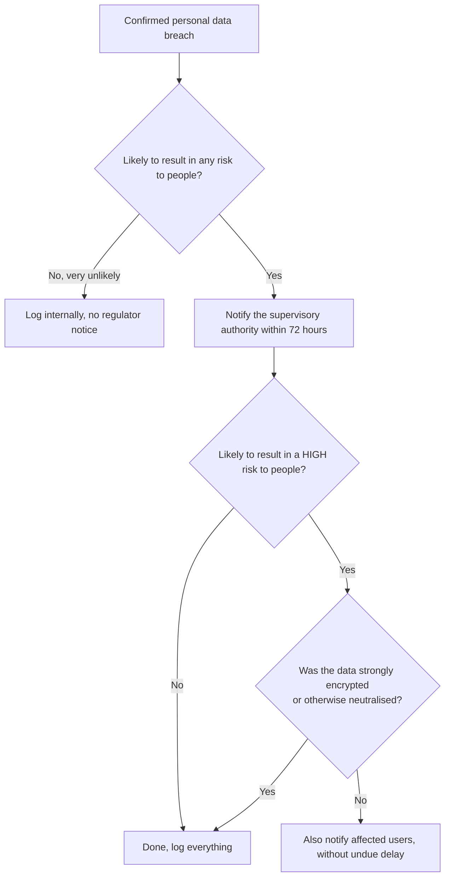

# Module 7: Security and What to Do When It Goes Wrong

<VideoEmbed
  src="https://www.youtube-nocookie.com/embed/PLACEHOLDER_ID_MODULE_07"
  title="Module 7: Security and What to Do When It Goes Wrong"
  timestamp="38:00 to 44:00"
  caption="What 'good enough' security looks like, and the 72-hour clock when it fails."
/>

Every business gets a security incident eventually. The GDPR has two rules for this chapter: keep the data safe in the first place (Article 32), and have a plan for the moment something goes wrong (Articles 33 and 34). This chapter walks through both, with worked examples from the four personas: Florinha, Quadrant, Aoife, Skyloop.

::: info Why this chapter matters
Breach notification is the single most common reason small companies meet their regulator for the first time. Getting the 72-hour clock right, and getting the user-notification call right, is what separates a quiet write-up from a public incident.
:::

## Security of processing (Article 32)

The rule is short and risk-based: take "appropriate technical and organisational measures" given the risk to people. <ArticleRef href="https://eur-lex.europa.eu/legal-content/EN/TXT/?uri=CELEX:32016R0679#d1e3955-1-1" label="Article 32" />

The Article lists four illustrative measures:

1. Pseudonymisation and encryption.
2. Ability to ensure ongoing confidentiality, integrity, availability, and resilience of systems.
3. Ability to restore access in a timely manner after a physical or technical incident (backups).
4. A process to test, assess, and evaluate the security measures regularly.

"Appropriate" scales with the risk and the state of the art. A two-person agency does not need a 24/7 SOC. A health-tech startup with millions of patient records does.

### A minimum that fits almost every small business

| Measure | Why it matters |
|---|---|
| Strong passwords + two-factor authentication on every admin account | Stops most credential-stuffing and phishing attacks |
| Full-disk encryption on every laptop and phone | Lost device becomes a small headache, not a notifiable breach |
| HTTPS / TLS everywhere | No plain-text customer data in flight |
| Least-privilege access (not everyone is admin) | Limits blast radius if one account is compromised |
| Off-site, tested backups | Lets you recover from ransomware without paying |
| Patch your servers and dependencies | Closes the windows attackers walk through |
| A one-page incident response plan | Saves you 30 panicked minutes when it counts |

::: tip Map to ISO 27001 if you already have it
If you already run an ISO 27001:2022 Information Security Management System, Annex A controls **5, 6, 8, and 16** map closely to what Article 32 expects. A short two-page mapping document between the two saves you arguing about it during an audit.
:::

## What a "personal data breach" actually is

A personal data breach has three flavours. <ArticleRef href="https://eur-lex.europa.eu/legal-content/EN/TXT/?uri=CELEX:32016R0679#d1e2050-1-1" label="Article 4(12)" />

| Flavour | In plain words | Example |
|---|---|---|
| Confidentiality | The data went somewhere it should not | A customer list emailed to the wrong recipient |
| Integrity | The data was changed when it should not have been | A hacker edited records in your database |
| Availability | You cannot get to the data | A ransomware attack locks your servers |

All three count. A misdirected email is a breach. A lost laptop with a customer file on it is a breach. A failed backup that loses a month of records is a breach.

## The 72-hour clock (Article 33)

Once you become aware of a personal data breach, you have **72 hours** to notify your supervisory authority, unless it is unlikely to result in a risk to people. <ArticleRef href="https://eur-lex.europa.eu/legal-content/EN/TXT/?uri=CELEX:32016R0679#d1e4029-1-1" label="Article 33" />

### When does the clock start?

When you become **aware** of the breach. That is the moment you have reasonable certainty that a breach happened, not the moment you start the investigation. The EDPB's <a href="https://www.edpb.europa.eu/our-work-tools/our-documents/guidelines/guidelines-92022-personal-data-breach-notification-under-regulation-2016679_en" target="_blank" rel="noopener noreferrer">Guidelines 9/2022 on breach notification</a> have the canonical version of this and are worth a careful read.

### What the notification has to contain

The Article 33(3) list:

- Nature of the breach (what happened).
- Categories and approximate number of people affected.
- Categories and approximate number of records affected.
- Name and contact of the DPO or other contact point.
- Likely consequences.
- Measures taken or proposed to address the breach and mitigate its effects.

You can notify in stages. If you do not have everything in 72 hours, send what you have and update later (Article 33(4) expressly allows this).

### Worked example: Skyloop ransomware overnight

A Skyloop on-call engineer wakes up at 03:00 to alerts: large parts of the production database are encrypted by ransomware.

The on-call runs the incident plan:

- **03:15.** Containment: production traffic isolated, the affected VMs powered down.
- **04:00.** The on-call has reasonable certainty that personal data was at minimum encrypted and possibly exfiltrated. The 72-hour clock starts here.
- **06:00.** A staged team is on a call. CTO, security lead, legal, comms. They begin a forensic investigation with an outside firm.
- **Hour 24.** Initial scope confirmed: roughly 240,000 user records were on the affected servers. No evidence yet of exfiltration. Backups are clean and restoration is under way.
- **Hour 30.** Initial notification filed with the Finnish supervisory authority (Tietosuojavaltuutettu). Stage 1, with what is known.
- **Hour 48.** Forensic firm confirms exfiltration of a 35,000-row subset. Skyloop updates the regulator and prepares the user-notification email.
- **Hour 60.** Affected users emailed (Article 34 trigger, see below).
- **Day 7.** Final report filed with the regulator. Skyloop publishes a public post-mortem.

### Worked example: Quadrant misdirected-email incident

A new Quadrant marketer accidentally emails a 1,200-row customer CSV to the wrong recipient (a personal Gmail address instead of an internal email).

The on-duty privacy lead walks through:

- **Hour 0.** Marketer realises the mistake and reports it within 30 minutes.
- **Hour 1.** Recipient is contacted, asked to delete the file (good faith), and confirms in writing.
- **Hour 2.** Privacy lead documents: 1,200 rows of names and emails (no passwords, no payment data). Risk assessment: low to moderate. The recipient is known, has confirmed deletion, and has no incentive to misuse the data.
- **Hour 30.** After weighing, Quadrant notifies the Berlin supervisory authority (BlnBDI) anyway because the volume is meaningful and the EDPB guidance leans towards notification when in doubt.
- **Hour 36.** No user notification: risk is judged low (no sensitive categories, recipient known and cooperative).

## Telling the affected people (Article 34)

You have to tell the affected people when the breach is **likely to result in a high risk** to them. <ArticleRef href="https://eur-lex.europa.eu/legal-content/EN/TXT/?uri=CELEX:32016R0679#d1e4099-1-1" label="Article 34" />

"High risk" is your judgement call, anchored in the EDPB's examples. Notify users if:

- Sensitive data is exposed (health, biometric, financial, account credentials).
- Identity fraud or financial loss is plausible.
- Special categories under Article 9 are involved.

You can skip the user notification if:

- The data was strongly encrypted and the keys were not compromised.
- You have already taken measures that make the high risk unlikely to materialise.
- It would involve disproportionate effort, in which case a public communication is enough.

The user notification has to be in clear, plain language. The Article 34(2) list:

- Nature of the breach.
- Contact for more information.
- Likely consequences.
- Measures you have taken or recommend.

## Notify or not? A quick flow

When in doubt, notify the regulator. Regulators rarely punish over-notification but routinely punish silence.

## A worked breach log entry

When the dust settles, the entry in your breach log looks like this:

| Field | Value |
|---|---|
| Incident ID | INC-2026-014 |
| Detected | 2026-04-18 03:15 (UTC) |
| Detected by | On-call alert + manual triage |
| Type | Confidentiality + availability |
| Description | Ransomware on production DB cluster A |
| Data categories affected | Account email, account name, hashed password, order history |
| Approximate number of people | 240,000 |
| Risk level | High |
| 72-hour deadline | 2026-04-21 04:00 |
| Authority notified date | 2026-04-19 10:00 (Stage 1) |
| Notify data subjects | Yes |
| Data subjects notified date | 2026-04-20 15:00 |
| Containment actions | Network isolation, restore from clean backup, password reset |
| Root cause | Outdated VPN appliance, unpatched CVE |
| Lessons | Patch SLA tightened to 7 days for critical CVEs; quarterly tabletop |
| Status | Closed |

::: tip We have a full Playbook for this
**Playbook 2: Respond to a personal data breach in 72 hours** is the operational version of this section, with a downloadable Excel breach-triage template. It lands after Module 10.
:::

## Common pitfalls

::: danger Four mistakes that show up in nearly every breach-related fine
1. **Late notification.** The 72-hour clock is taken seriously. "We were still investigating" is not a defence; you can notify in stages.
2. **Over-narrow scoping.** Counting only the records you can confirm were accessed, not the full population that was at risk. The EDPB expects "categories and approximate number," not a perfect tally.
3. **Forgetting Article 34.** Notifying the regulator but not the users when the risk is high.
4. **No rehearsal.** A first-time breach team takes hours longer to act than a team that has run a tabletop. One annual rehearsal pays for itself the first time it counts.
:::

## Module 7 takeaways

- Article 32 is risk-based. Match the security to the data and the threat.
- A breach is anything that affects confidentiality, integrity, or availability of personal data. Misdirected emails count.
- The 72-hour clock starts when you have reasonable certainty a breach happened.
- You can notify in stages. The Article 33(3) content list is the minimum first dispatch.
- Article 34 user-notification kicks in when the risk to people is **high**.
- Encryption at rest can take you out of the user-notification obligation if the keys were not compromised.

## Quick self-audit

- [ ] We have a one-page incident response plan with names, phone numbers, and the path to the breach log.
- [ ] We have a way to detect a breach (alerts, monitoring, or at minimum staff training to report incidents fast).
- [ ] We know which supervisory authority to notify and how (URL or email).
- [ ] Our laptops, phones, and backups are encrypted.
- [ ] We have run at least one tabletop or dry-run in the last 12 months.
- [ ] Our processors' DPAs require them to notify us of a breach within 24 hours.
- [ ] We have a template user-notification email pre-drafted.

## Source anchors

- <ArticleRef href="https://eur-lex.europa.eu/legal-content/EN/TXT/?uri=CELEX:32016R0679#d1e3955-1-1" label="Article 32 GDPR (security of processing)" />
- <ArticleRef href="https://eur-lex.europa.eu/legal-content/EN/TXT/?uri=CELEX:32016R0679#d1e4029-1-1" label="Article 33 GDPR (notification to authority)" />
- <ArticleRef href="https://eur-lex.europa.eu/legal-content/EN/TXT/?uri=CELEX:32016R0679#d1e4099-1-1" label="Article 34 GDPR (communication to data subjects)" />
- <ArticleRef href="https://eur-lex.europa.eu/legal-content/EN/TXT/?uri=CELEX:32016R0679#d1e2050-1-1" label="Article 4(12) GDPR (definition of breach)" />
- EDPB <a href="https://www.edpb.europa.eu/our-work-tools/our-documents/guidelines/guidelines-92022-personal-data-breach-notification-under-regulation-2016679_en" target="_blank" rel="noopener noreferrer">Guidelines 9/2022 on personal data breach notification</a>

::: info Next up
Module 8 covers the moment your data leaves the EU: adequacy decisions, Standard Contractual Clauses, the EU-US Data Privacy Framework, and the supplementary measures the Schrems II judgement made famous.
:::

<CtaBlock />
