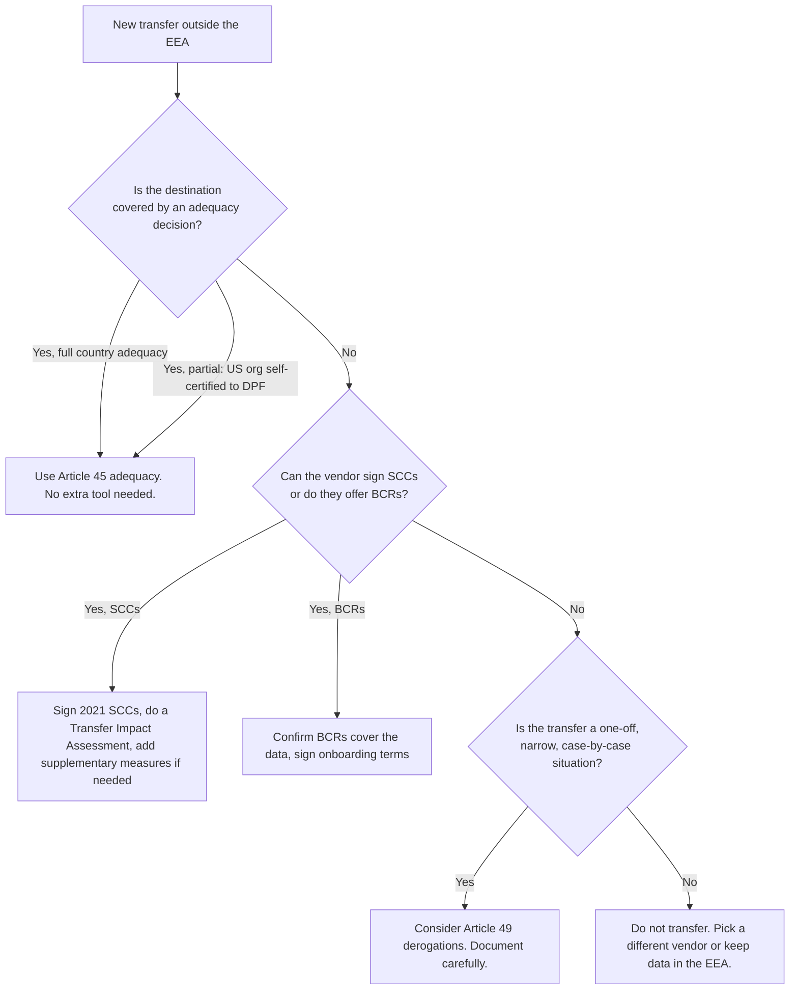

# Module 8: Sending Data Abroad

<VideoEmbed
  src="https://www.youtube-nocookie.com/embed/PLACEHOLDER_ID_MODULE_08"
  title="Module 8: Sending Data Abroad"
  timestamp="44:00 to 50:00"
  caption="Every SaaS tool eventually pushes data across a border. The rules for doing it safely."
/>

Almost every SaaS tool you use routes data through somewhere. Often that somewhere is outside the European Economic Area (EEA), most commonly the United States. The GDPR allows this, but only if a specific "transfer tool" is in place. This chapter walks through the rules in plain English, using the four personas: Florinha (Lisbon plant shop), Quadrant (Berlin SaaS), Aoife (Dublin freelance UX consultant), Skyloop (Helsinki mobile-app studio).

The rules live in <ArticleRef href="https://eur-lex.europa.eu/legal-content/EN/TXT/?uri=CELEX:32016R0679#d1e4738-1-1" label="Chapter V (Articles 44 to 50) of the GDPR" />.

::: info Why this chapter matters
The most expensive GDPR fine ever issued (Meta, EUR 1.2 billion, May 2023) was for an international transfer problem. The Schrems II judgement (CJEU, July 2020) reshaped how every EU business has to think about US clouds. Get this chapter wrong and you can spend years untangling it.
:::

## The general principle (Article 44)

Personal data can only leave the EEA if you have a **transfer tool** from Chapter V in place. No tool, no transfer. <ArticleRef href="https://eur-lex.europa.eu/legal-content/EN/TXT/?uri=CELEX:32016R0679#d1e4738-1-1" label="Article 44" />

There are three families of tools, in order of preference:

1. **Adequacy decision** (Art. 45). The European Commission has officially decided the destination country offers protection essentially equivalent to the EU.
2. **Appropriate safeguards** (Art. 46). You use a pre-approved contract template or internal rules.
3. **Derogations** (Art. 49). Narrow, case-by-case exceptions for specific situations.

## Adequacy decisions (Article 45)

These are the green-flagged countries. Transfers to an adequate country are treated like transfers within the EU. No extra paperwork, just keep your normal compliance in place.

The current adequacy list (as of 2026):

- Andorra, Argentina, Canada (commercial organisations only), Faroe Islands, Guernsey, Isle of Man, Israel, Japan, Jersey, New Zealand, Republic of Korea, Switzerland, United Kingdom, Uruguay.
- **United States** through the **EU-US Data Privacy Framework** (DPF), in force since July 2023. Only the specific US organisations that have self-certified to the DPF count.

The Commission keeps the official list at <a href="https://commission.europa.eu/law/law-topic/data-protection/international-dimension-data-protection/adequacy-decisions_en" target="_blank" rel="noopener noreferrer">commission.europa.eu</a>.

### What about the United States?

The US has been a long-running headache. Two earlier deals (Safe Harbor, then Privacy Shield) were struck down by the CJEU in the **Schrems I** (2015) and **Schrems II** (2020) judgements, because US surveillance law gave intelligence agencies access that the Court considered disproportionate.

The current **EU-US Data Privacy Framework** (DPF) is the third attempt. It adds new safeguards (a Data Protection Review Court for EU individuals) and was approved by the Commission in July 2023.

Key practical point: a US vendor is **only** covered by the DPF if it has self-certified. You check the live list at <a href="https://www.dataprivacyframework.gov/" target="_blank" rel="noopener noreferrer">dataprivacyframework.gov</a>. Many US vendors are not on the list. For those, you need a different transfer tool (usually SCCs, see below).

## Appropriate safeguards (Article 46)

When the destination country has no adequacy, you fall back to one of these:

- **Standard Contractual Clauses** (SCCs): a pre-approved contract template published by the Commission. The current version is the 2021 modular SCCs.
- **Binding Corporate Rules** (BCRs): internal rules a multinational adopts for transfers within its own group, approved by a lead supervisory authority. Heavy lift, mostly large enterprises.
- **Approved codes of conduct or certifications**: still rare in practice.

### The 2021 SCCs in 90 seconds

There are four "modules" you pick from, depending on who is sending and who is receiving:

| Module | From | To |
|---|---|---|
| 1 | Controller | Controller |
| 2 | Controller | Processor |
| 3 | Processor | Processor |
| 4 | Processor | Controller |

Pick the right module, fill in the annexes (parties, transferred data, security measures, sub-processors), sign, file.

Most reputable SaaS vendors bundle the 2021 SCCs into their DPA. You sign the DPA and the SCCs are incorporated.

## Schrems II and supplementary measures

The Schrems II judgement (CJEU C-311/18, July 2020) added a requirement that goes beyond just having SCCs in place. You also have to **assess** whether the destination country's laws actually let the SCCs work. If local surveillance law lets the government bypass the SCCs, you need **supplementary measures** to make the data unreadable to the surveillance regime.

The EDPB's <a href="https://www.edpb.europa.eu/our-work-tools/our-documents/recommendations/recommendations-012020-measures-supplement-transfer_en" target="_blank" rel="noopener noreferrer">Recommendations 01/2020 on supplementary measures</a> are the canonical playbook. The six-step process:

1. Know your transfers (you cannot protect what you have not mapped).
2. Identify the transfer tool you rely on.
3. Assess if it is effective in the destination country's legal context.
4. Add supplementary measures where needed (encryption with EU-held keys, pseudonymisation, splitting data so no single recipient sees identifiable info).
5. Take any formal procedural steps.
6. Re-evaluate at intervals.

The output of step 3 is called a **Transfer Impact Assessment** (TIA). It is a written document. Like LIAs and DPIAs, the regulator will ask to see it.

### Worked example: Florinha picking Google Analytics 4

Florinha wants Google Analytics 4 on the shop website. Google routes some analytics data through the US.

- **Transfer tool**: GA4 is run by Google LLC (US). Google LLC self-certified to the EU-US DPF on day one. So the transfer is covered by an **adequacy decision** (via the DPF).
- **Supplementary measures**: with adequacy in place, none strictly required. Florinha still turns on Google's "EU data location" feature and IP-truncation for belt-and-braces.
- **TIA**: light. The DPF takes most of the burden off.

### Worked example: Quadrant using a US-based help-desk SaaS

Quadrant picks a US help-desk SaaS that is **not** DPF-certified.

- **Transfer tool**: 2021 SCCs (module 2: controller to processor), built into the help-desk DPA.
- **Supplementary measures**: a TIA. The vendor's data centres are in Virginia. US Foreign Intelligence Surveillance Act (FISA) section 702 applies. Quadrant adds: encryption at rest with keys held by an EU-based KMS, pseudonymisation of customer-record fields stored in tickets, and a documented data-minimisation policy on what the support team copies into tickets.
- **TIA outcome**: documented, kept on file, re-checked annually or when the vendor changes sub-processors.

### Worked example: Aoife's Google Workspace

Aoife uses Google Workspace for client email.

- **Transfer tool**: Google Workspace's EU customer terms incorporate the 2021 SCCs **and** rely on the DPF where applicable. Belt-and-braces by design.
- **Supplementary measures**: Aoife enables EU-data-region storage and Google's Client-side Encryption for the few clients that need it.
- **TIA**: short, kept on file.

## Derogations (Article 49)

Narrow exceptions for one-off situations. <ArticleRef href="https://eur-lex.europa.eu/legal-content/EN/TXT/?uri=CELEX:32016R0679#d1e4936-1-1" label="Article 49" />

- The data subject explicitly consented to the specific transfer.
- The transfer is necessary for the performance of a contract with the data subject (booking a hotel abroad, for example).
- Necessary for important reasons of public interest.
- Necessary for legal claims.
- Necessary to protect vital interests where the person cannot consent.
- The transfer is from a public register.

These are **case by case**. Article 49 is not a tool for systematic, repeated transfers. The EDPB has been clear about this.

## Which tool fits?

If you end up at "do not transfer," that answer is allowed. EU-based alternatives exist for most SaaS categories.

## Onward transfers and the chain

The transfer rules cascade. If you send data to a US processor and that processor sends it to a sub-processor in India, **both legs** need a transfer tool. Many DPAs handle this with a "back-to-back" clause that requires sub-processors to be bound by the same SCCs.

Real-world fines (Meta 2023, in part) have hinged on onward transfers that were not properly covered. Read your processor's sub-processor list and check the transfer mechanism for each.

## Common pitfalls

::: danger Four mistakes that show up in nearly every transfer-related fine
1. **No Transfer Impact Assessment.** Having SCCs is not enough after Schrems II. The TIA is the homework.
2. **Wrong SCC module.** Using "controller to processor" when the relationship is actually "processor to processor." The annexes do not match the reality.
3. **Treating onward transfers as someone else's problem.** Your processor's sub-processor in a third country is still your concern.
4. **Assuming a US vendor is DPF-covered.** Always check the live list at dataprivacyframework.gov; many big names are not on it.
:::

## Module 8 takeaways

- Every transfer outside the EEA needs a tool from Chapter V.
- Adequacy is the simplest. The UK, Japan, Switzerland and others have full adequacy. The US has adequacy only through the EU-US DPF, only for self-certified organisations.
- Below adequacy, the 2021 modular SCCs are the workhorse, with a Transfer Impact Assessment.
- Schrems II added the "supplementary measures" layer. Encryption with EU-held keys is the standard answer.
- Article 49 derogations exist but only for narrow, one-off cases. Not a systematic tool.
- Onward transfers cascade. Read the sub-processor list.

## Quick self-audit

- [ ] We have a list of every system that processes our data outside the EEA.
- [ ] For each, we know which transfer tool applies (adequacy, SCC, BCR, derogation).
- [ ] For each non-adequacy transfer, we have a Transfer Impact Assessment on file.
- [ ] For any US vendor we rely on the DPF for, we have confirmed they are self-certified.
- [ ] Our SCCs are the 2021 modular ones, with the right module picked.
- [ ] We have at least encryption at rest with keys we control for sensitive transferred data.
- [ ] We re-check the sub-processor lists of our main vendors at least yearly.

## Source anchors

- <ArticleRef href="https://eur-lex.europa.eu/legal-content/EN/TXT/?uri=CELEX:32016R0679#d1e4738-1-1" label="Article 44 GDPR (general principle for transfers)" />
- <ArticleRef href="https://eur-lex.europa.eu/legal-content/EN/TXT/?uri=CELEX:32016R0679#d1e4761-1-1" label="Article 45 GDPR (adequacy decisions)" />
- <ArticleRef href="https://eur-lex.europa.eu/legal-content/EN/TXT/?uri=CELEX:32016R0679#d1e4805-1-1" label="Article 46 GDPR (appropriate safeguards)" />
- <ArticleRef href="https://eur-lex.europa.eu/legal-content/EN/TXT/?uri=CELEX:32016R0679#d1e4936-1-1" label="Article 49 GDPR (derogations)" />
- EDPB <a href="https://www.edpb.europa.eu/our-work-tools/our-documents/recommendations/recommendations-012020-measures-supplement-transfer_en" target="_blank" rel="noopener noreferrer">Recommendations 01/2020 on supplementary measures</a>
- Commission Implementing Decision (EU) 2021/914 (the 2021 SCCs).
- Commission Implementing Decision (EU) 2023/1795 (the EU-US Data Privacy Framework adequacy).
- CJEU, Case C-311/18 (Schrems II), 16 July 2020.

::: info Next up
Module 9 covers when you need to run a privacy review before launching something new (DPIA) and when you need to appoint a designated privacy officer (DPO).
:::

<CtaBlock />
