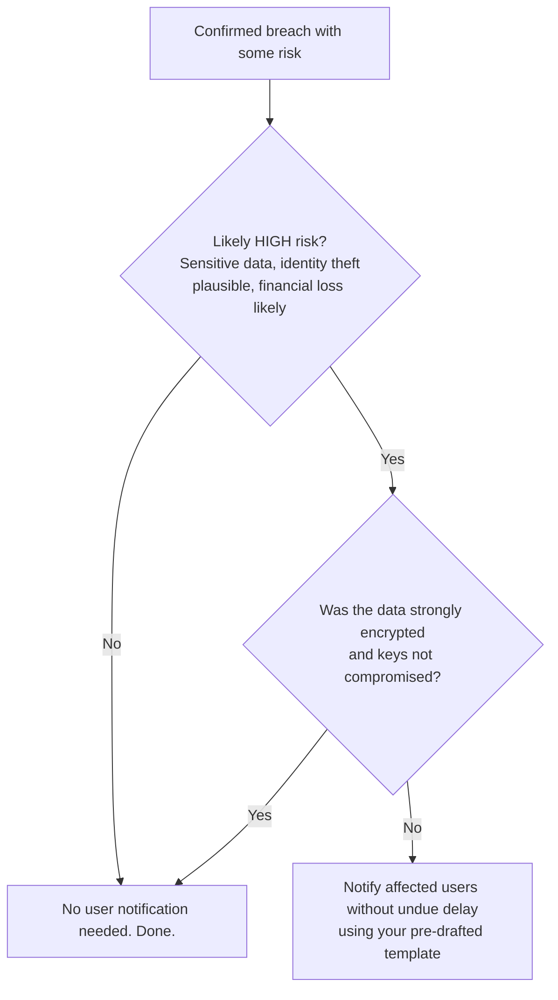

# Playbook 2: Respond to a Personal Data Breach in 72 Hours

Something went wrong. A customer list went to the wrong inbox, a laptop was stolen, a server got ransomware. You have **72 hours** to notify your supervisory authority if the breach is likely to result in any risk to people. This Playbook is the operational version of [Module 7 (Security and What to Do When It Goes Wrong)](/modules/07-security-breach), paired with a downloadable Excel triage log.

::: tip Background reading
Module 7 explains the legal "why" behind every step here, including the difference between Article 33 (notify the regulator) and Article 34 (notify the affected users).
:::

## Before you start

Five things to put in place once, so the next incident is faster.

1. **A named incident commander** (and a backup). One person calls the shots so the room is not a debate club at 3am.
2. **A short contact list**: legal, comms, security lead, CEO, lead DPA contact, outside forensic firm (if you have one on retainer).
3. **The supervisory-authority URL** for filing a notification. Bookmark it.
4. **A pre-drafted user-notification email template.** Half a page. Plain language.
5. **The triage log.** Use the Excel template below or your own equivalent.

## The runbook

### Hour 0: Detection

Somebody notices. A monitoring alert, a customer email, a journalist's question, an internal report. The first person:

- Tells the incident commander **immediately**. No "let me check first."
- Creates a row in the triage log: `INC-YYYY-NNN`.

The commander decides whether this is an incident (yes if there is any chance personal data was affected).

### Hour 0 to 2: Contain

Stop the bleeding before you start the investigation.

- Disable the compromised account, revoke the leaked token, isolate the affected server.
- Capture evidence: snapshot logs, preserve disk images if relevant.
- Get the incident commander on a private call (Signal, encrypted bridge) with the immediate team.

### Hour 2 to 12: Initial assessment

Answer these questions in the triage log:

| Question | Answer goes in column |
|---|---|
| What happened? | Description |
| What kind of breach? | Type (Confidentiality / Integrity / Availability) |
| Which categories of data? | Data categories affected |
| Roughly how many people? | Approx. people affected |
| When did we become aware? | Detected date + time |
| When is the 72-hour deadline? | 72h deadline (Detected + 72h) |

"Awareness" means reasonable certainty a breach happened, not the moment you have all the facts. The clock starts here.

::: tip You can notify in stages
Article 33(4) explicitly allows phased notification. File what you know in the first 72 hours and update as more becomes clear. **Late is worse than incomplete.**
:::

### Hour 12 to 48: Forensics and scope

- Bring in the forensic firm if needed.
- Confirm or revise the scope (was it 1,200 records or 240,000?).
- Identify the root cause as far as you can.
- Update the triage log as facts firm up.

### Hour 48 to 60: Notify the authority

If the breach is likely to result in any risk to people, file with the supervisory authority. The Article 33(3) content:

- Nature of the breach.
- Categories and approximate number of people and records affected.
- Contact point (the DPO or privacy lead).
- Likely consequences.
- Measures taken or proposed.

Most regulators have an online form. Fill it in, attach what you have, file. Do not wait for perfect information.

### Hour 60 to 72: Decide on user notification

The Article 34 question: is the breach likely to result in a **high risk** to the affected people?

If yes, send the user-notification email. Article 34(2) content:

- Nature of the breach.
- Contact for more information.
- Likely consequences.
- Measures the user can take (reset password, watch for fraud).

### Day 3 onwards: Remediation and lessons

- Close the original root cause.
- Add the patch / control to your standard runbook.
- Write a short internal post-mortem with at least one concrete change.
- Update the triage log "Lessons" column.

### After the dust settles

- The regulator may come back with follow-up questions. Cooperate.
- File the full triage log entry for at least 3 years (longer if regulator follow-up is open).
- Add a calendar reminder to re-test the lesson 6 months later.

## The Excel template

[**Download breach-triage.xlsx**](/checklists/breach-triage.xlsx)

Columns: Incident ID, Detected date, Detected time, Detected by, Type (C/I/A), Description, Data categories affected, Approx. people affected, Risk level, 72h deadline, Authority notified date, Notify data subjects, Subjects notified date, Containment actions, Root cause, Lessons, Status.

Use one row per incident. Filter by Status to see what is still open.

## A worked example: Skyloop

(Same Skyloop we have been using since Module 4.)

A Skyloop on-call engineer wakes at 03:00 to alerts: production DB cluster A is encrypted by ransomware.

| Hour | Action |
|---|---|
| 0 (03:00) | Engineer pages the incident commander. Triage log row created: `INC-2026-014`. |
| 0:15 | Production traffic isolated. Affected VMs powered down. |
| 1 | Initial scope: encrypted database, possible exfiltration. Awareness confirmed. 72h clock starts. |
| 3 | Forensic firm engaged. |
| 24 | Scope confirmed: ~240,000 user records, no confirmed exfiltration yet. Backups restoring. |
| 30 | Stage 1 notification filed with the Finnish supervisory authority. |
| 48 | Forensics confirms exfiltration of a 35,000-row subset. Update filed. |
| 60 | User notification email sent to the 35,000 affected people. |
| Day 7 | Full report filed. Post-mortem published. |

Cycle time to first notification: 30 hours. The lesson ("patch SLA tightened to 7 days for critical CVEs") was implemented within two weeks.

## What to do if it goes wrong

- **You miss the 72 hours.** File anyway as soon as you can. Article 33(1) requires a reason for the delay. Honesty beats silence.
- **You over-notified.** Rare to be penalised for this. The regulator may close with no further action.
- **The breach is by a processor (your vendor).** Their DPA should require them to notify you within 24 hours of becoming aware. The 72-hour clock for you starts when **you** become aware via the processor's notification.
- **The breach is much bigger than first thought.** Update the regulator promptly with the revised scope. Do not hide the upward revision.

## When to call for help

For any breach that involves:

- Sensitive special-category data,
- More than a few thousand people,
- Confirmed exfiltration,
- Or any sign of organised crime / state actor,

talk to a privacy lawyer **and** a specialist incident-response firm in the first 24 hours. The cost of getting it wrong dwarfs the cost of getting the right help quickly.

<CtaBlock />
